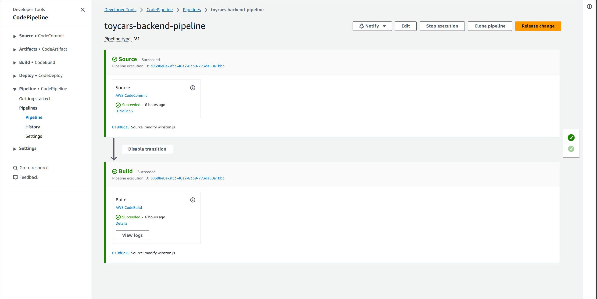
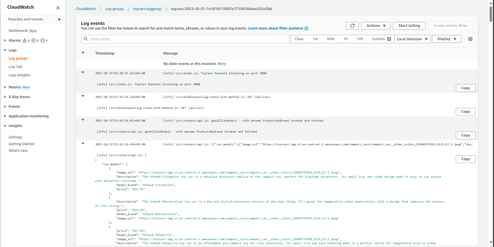
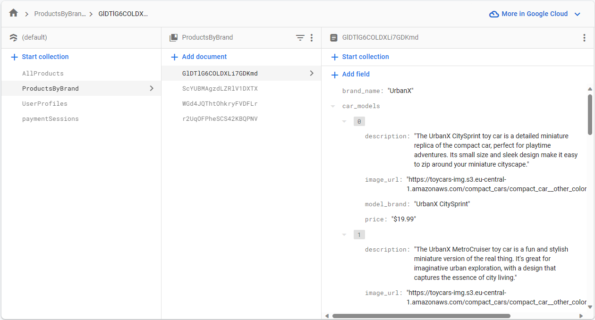
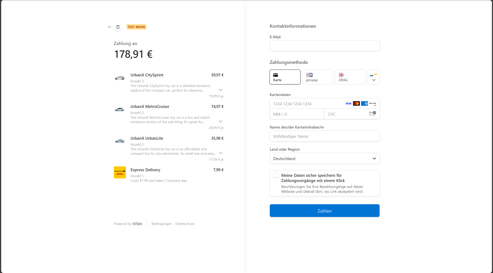
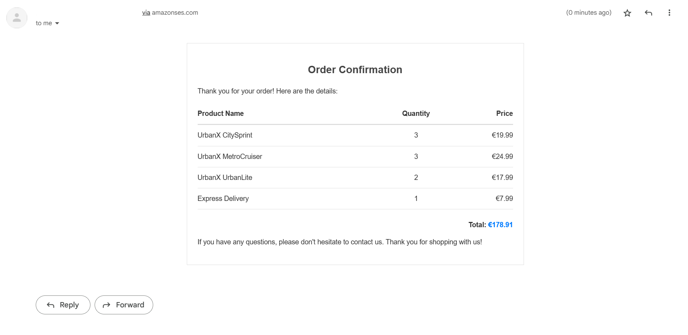

# Toy Cars Store Project - Backend Repository

## Features

### Deployed along with the frontend on EC2 Instance using Docker Swarm

- This provides automatic service restarts in case of errors. With Elastic IP enabled, it offers a consistent endpoint for the users to access the website.
- [docker-compose.yml file](./docker-compose.yml)

### Automated AWS CodePipeline builds image and pushes to AWS ECR once code is committed to the repository.

- A fully functioned pipeline ensures that the latest version of the application is built and pushed directly to a container registry for deployment readiness.
- [buildspec.yml for CodeBuild](./buildspec.yml)



### ElasticSearch Integration - [elasticsearch.js code](./src/services/elasticsearch.js)

- ElasticSearch query for the JavaScript CDK is populated programmatically based on user input. Full text fuzzy search functionality and price sorting for products is implemented via ElasticSearch in the [`/api/search` route](https://github.com/lenguyenhcm325/backend-toycars/blob/main/src/routers/api.js#L64). (Currently using _free-trial plan_ just for demonstration purpose)

### Nginx serves as a reverse proxy

- Both the frontend and backend are containerized using Docker, with Nginx acting as a reverse proxy. Nginx addresses CORS issues and also help with service discovery between the services.

- [nginx.conf file](./src/nginx.conf)

- nginx configuration in [docker-compose.yml](./docker-compose.yml):

  ```yml
  nginx:
  image: nginx:latest
  ports:
    - "80:80"
  volumes:
    - ./nginx.conf:/etc/nginx/conf.d/default.conf
  networks:
    - appnetwork
  deploy:
  replicas: 1
  restart_policy:
    condition: on-failure
  healthcheck:
  disable: true
  depends_on:
    - frontend
    - backend
  ```

### Logging with Winston and push to CloudWatch Logs - [Winston customized logging code](./src/services/winston.js)

- Using the custom `Logger` function with various logging levels, Winston handles logging reliably to the terminal and CloudWatch Logs, facilitating better debugging in case of errors.

  ```javascript
  // Import statement in other files:
  const Logger = require("./services/winston");
  const logger = Logger(__filename);
  ```

- Example logs:

  

### Optimized Firestore collection structures for different querying needs.

- Utilizing multiple collections with tailored structures enhance query performance.

<!-- - for example: for the homepage `/` each brand has their own sections displaying just their own products, `ProductsByBrand` collection already gets the data partitioned by brand, the other collection `AllProducts` facilitate fast fetching of certain attributes of a specific product. -->

- For instance, on the homepage `/`, each brand has a seperate section for its products. The `ProductsByBrand` collection segments products by brand, while the `AllProducts` collection allows rapid retrieval of specific product attributes once the product's name is specified.

  

### Stripe API Test Integration - [/payment/create-checkout-session route code](https://github.com/lenguyenhcm325/backend-toycars/blob/main/src/routers/payment.js#L19)

- Clicking "Checkout" on the frontend sends cart items to the backend, prompting Stripe to initiate a checkout session with a genuine-looking UI for payment details. Users can simulate payment using a mock credit card.

  

### Send email automatically after successful payment with AWS Simple Email Service - [ses.js code](./src/services/ses.js)

- **Disclaimer:** Due to AWS SES's restrictions for non-production web apps, this application operates in SES sandbox mode and can only send emails to verified addresses.

- After Stripe's redirection to the frontend, an order confirmation email detailing product information, quantity, and shipping cost is sent to the user. Along with this, the related Stripe PaymentIntent object gets the `alreadySentMail` metadata's attribute updated to `true`

  

### [Easy Diffusion](https://github.com/easydiffusion/easydiffusion) to generate, Amazon S3 to store product images.

- Product images on the site are generated through Easy Diffusion, a local application that leverages Stable Diffusion for high-quality images. All images are stored on Amazon S3.
